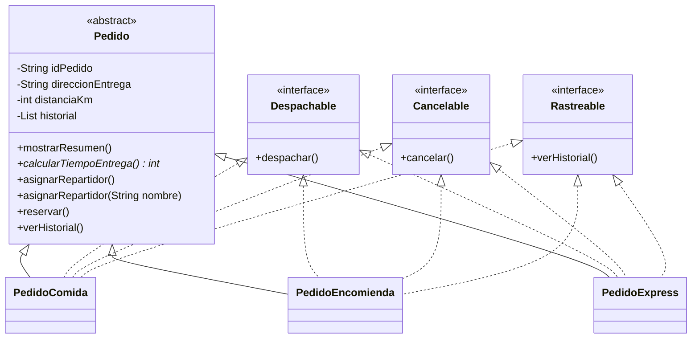

# SpeedFast - Semana 3

Versión integral del sistema de entregas SpeedFast para Desarrollo Orientado a
Objetos II.

## Funcionalidades

- Pedidos de comida, encomienda y express con tiempos de entrega distintos.
- Asignación automática y manual de repartidores.
- Reserva, despacho y cancelación de pedidos.
- Historial de operaciones almacenado en un `ArrayList`.
- Uso de las interfaces `Despachable`, `Cancelable` y `Rastreable`.

## Diagrama de clases

La clase `Pedido` concentra los datos y operaciones comunes. Sus subclases
personalizan la asignación, el cálculo, el despacho y la cancelación. Las
interfaces separan las operaciones funcionales y permiten utilizar distintos
tipos de pedido de la misma manera. Esta estructura facilita agregar nuevos
pedidos sin repetir la lógica común.

## Ejecución

Abre `SpeedFastSemana3` en IntelliJ IDEA y ejecuta `app.Main`.
